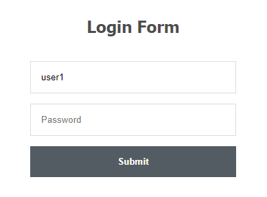

# Basic-Admin-User-Login-Logout-Express-session-Mysql

## To Install

* Git Clone the repository
* Navigate to the folder where the repository exists using Git Bash or Terminal
* Run the command `npm install` to download the required dependencies
* Then run the command `node login.js` to run the program

## To Login
* Add username & password in mysql database

* Admin Login 

   - ID: admin1

   - PW: admin1

* User Login 

   - ID: user1

   - PW: user1

## Screenshot
* Login Page

  

* Admin Page

  

* User Page

  

